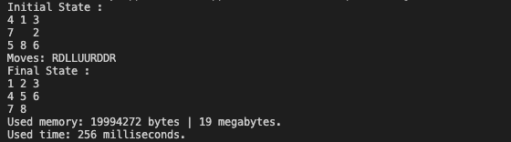

# ai-puzzle-8
Puzzle 8 game environment &amp; agent (to solve a randomly generated game state)

Algorithm: Breadth First Search

## Usage:
- Run `tileGame.java`
- Run `agent.java` directly (Solves a random game state with depth = 15)
  - Or remove `game.newGameDepth(15)` to solve a completely random state

## Demo:
Initial game state: Random state with depth = 12

